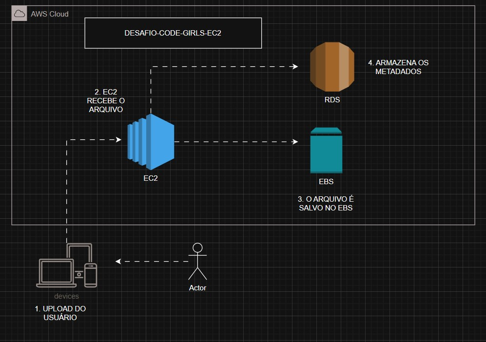
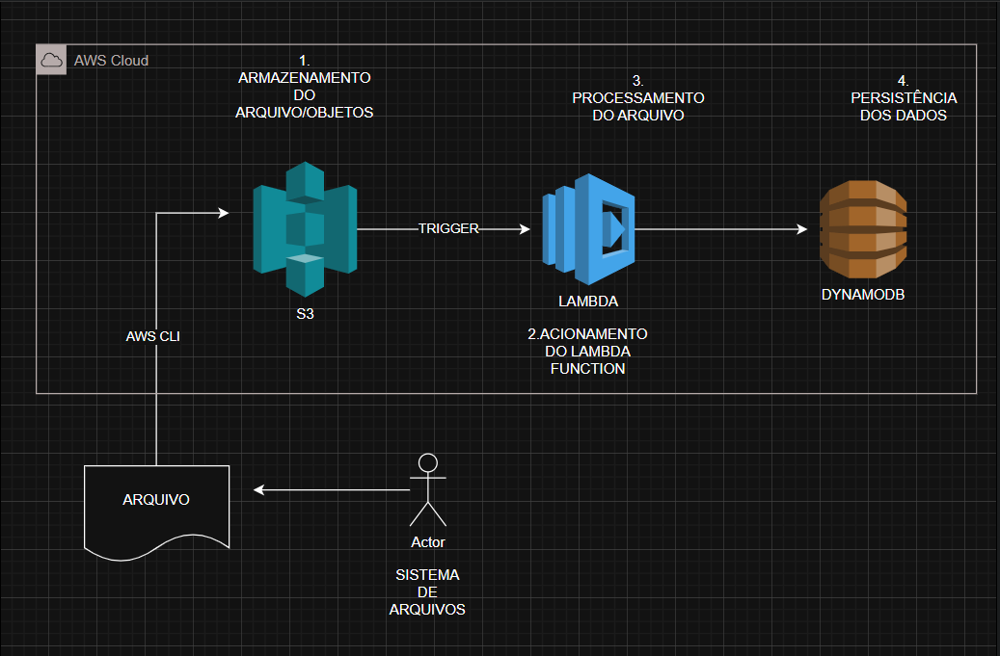
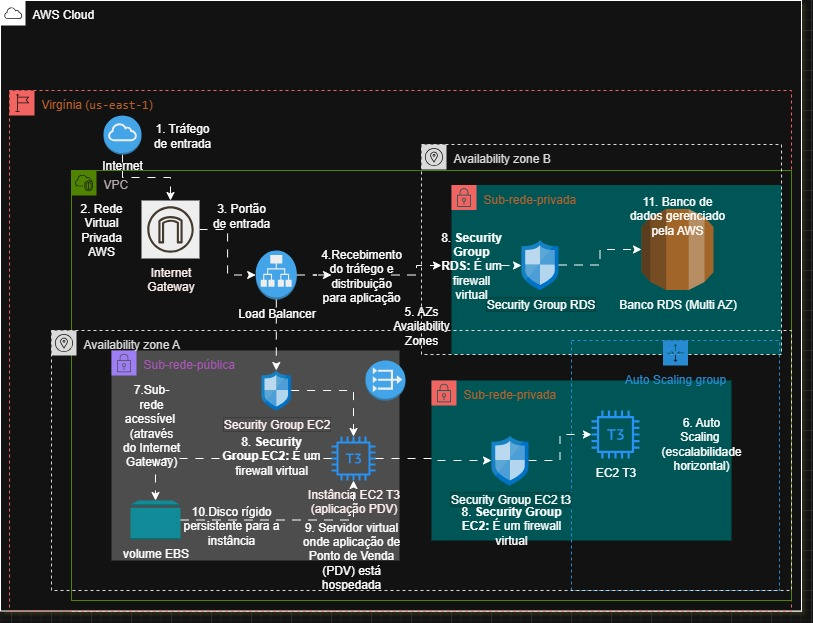

# desafio-code-girls-AWS-ec2
Documentação e anotações do desafio de AWS EC2 da DIO. Este repositório serve como material de apoio para consolidar e demonstrar o aprendizado sobre o gerenciamento de instâncias EC2.

---

### **Fluxo de Upload de Arquivo na AWS com EC2, EBS e RDS**
O diagrama abaixo representa o fluxo de um upload de arquivo para a nuvem AWS, usando uma instância EC2 (Elastic Compute Cloud) que é do tipo IAAS (Infrastructure as a Service) para receber o arquivo. Ele é salvo em um volume EBS (Elastic Block Store) que é uma storage altamente confiável, enquanto seus metadados são armazenados em um banco de dados RDS (Relational Database Service). A arquitetura demonstra um uso combinado de serviços de infraestrutura e gerenciamento de dados da AWS.

### **Diagrama da Arquitetura**
A arquitetura é representada no seguinte diagrama:

### **Componentes da Arquitetura**

| Componente | Função |
| :--- | :--- |
| **EC2 (Elastic Compute Cloud)** | É do tipo IAAS (Infrastructure as a Service), uma máquina virtual na nuvem composta por uma CPU, memória, dico, rede e um sistema operacional. |
| **Internet Gateway** | Permite que o tráfego da internet entre na sua VPC, atuando como o ponto de entrada principal. |
| **RDS (Relational Databasde Service** | É um serviço Amazon Web Services (AWS) que simplifica o gerenciamento de banco de dados relacionais na nuvem . |
| **EBS (Elastic Block Store)** | É um serviço de armazenamento da Amazon Web Services que fornece volumes de disco persistente para as instâncias EC2 . |

### **Fluxo de Dados**
1.  É iniciado o processo de **Upload do arquivo do usuário** a partir de um dispositivo.
2.  A **Instância EC2** recebe o arquivo, atuando como servidor que processa o upload.
3.  O arquivo é salvo no volume **EBS**, garantindo que o dado seja armazenado de forma persistente e segura.
4.  Ocorre o armazenamento dos metadados no banco de dados **RDS**, facilitando a organização e futura consulta.

---

### **Fluxo de Processamento de Arquivos com S3, Lambda e DynamoDB**
O diagrama abaixo representa o **fluxo de upload** de um arquivo para a nuvem através da interface **AWS CLI (Command Line Interface)** que permite a interação dos serviços **AWS (Amazon Web Services)** diretamente terminal. 
Esse arquivo é armazenado em um **bucket S3 (Simple Storage Service)**, um serviço de armazenamento de objetos, projetado para guardar e recuperar qualquer quantidade de dados, de qualquer lugar, a qualquer momento. Esse **evento** dispara um **gatilho (trigger)**, que aciona a função **Lambda**. O **Lambda** executa o código escrito que processa os dados, que são por fim armazenados e mantidos de forma persistente no banco de dados **DynamoDB**.

### **Diagrama de Arquitetura**
A arquitetura é representada no seguinte diagrama:

### **Componentes da Arquitetura**

| Componente | Função |
| :--- | :--- |
| **AWS CLI (Command Line Interface)** | É a interface de linha de comando usada para fazer o upload de arquivos para a nuvem diretamente do terminal. |
| **S3 (Simple Storage Service)** | É o serviço de armazenamento de objetos que recebe o arquivo e atua como ponto de entrada do fluxo. |
| **Lambda** | É o serviço de computação serverless que é acionado por **eventos** ,como o **(S3)**, para processar o arquivo . |
| **DynamoDb (Banco de dados NoSql)** | É o banco de dados onde os dados já processados são armazenados de forma persistente. |

### **Fluxo de Dados**
1.  É feito o upload de um arquivo do **sistema local do usuário** para um **bucket S3**, utilizando a interface de linha de comando **AWS CLI**.
2.  O armazenamento do arquivo no ** bucket S3** gera um **evento** que funciona como um **gatilho (trigger)**. Esse gatilho ativa a função **Lambda** automaticamente.
3.  A função **Lambda** é executada para processar o arquivo que foi recebido do ** bucket S3**.
4.  Após o processamento, a função **Lambda** armazena os dados resultantes no banco de dados **DynamoDB** para que sejam persistidos e possam ser consultados futuramente.

---

### **Projeto de Arquitetura AWS para Aplicação de Ponto de Venda (PDV)**

#### **Visão Geral**
Este projeto documenta uma arquitetura de referência para uma aplicação de Ponto de Venda (PDV) na nuvem AWS. O objetivo principal é criar uma solução que seja **altamente disponível**, **escalável** e **segura**, capaz de lidar com picos de tráfego e garantir a resiliência em caso de falhas.

A arquitetura foi construída seguindo as boas práticas do AWS Well-Architected Framework, utilizando serviços gerenciados para simplificar a operação e otimizar custos.

### **Diagrama da Arquitetura**
A arquitetura é representada no seguinte diagrama:

### **Componentes da Arquitetura**

| Componente | Função |
| :--- | :--- |
| **VPC** | É a sua rede virtual privada na AWS, isolando todos os recursos do projeto em um ambiente seguro. |
| **Internet Gateway** | Permite que o tráfego da internet entre na sua VPC, atuando como o ponto de entrada principal. |
| **Load Balancer** | Recebe todo o tráfego da internet e o distribui de forma uniforme para as instâncias da aplicação. Ele também monitora a saúde das instâncias, garantindo que o tráfego seja enviado apenas para servidores saudáveis. |
| **Availability Zones (AZs)** | A arquitetura utiliza duas AZs para garantir que, em caso de falha de uma delas, o serviço continue operando na outra, proporcionando alta disponibilidade. |
| **Auto Scaling Group (ASG)** | Gerencia a quantidade de instâncias da aplicação (EC2). Ele escala horizontalmente (cria novas instâncias) para lidar com o aumento de tráfego e reduz o número de instâncias quando o tráfego diminui, otimizando os custos. |
| **Instância EC2 T3** | São os servidores virtuais que hospedam a aplicação PDV. O ASG garante que sempre haja instâncias operacionais em ambas as AZs. |
| **Sub-rede Pública** | Contém os recursos que precisam ser acessíveis pela internet, como o Load Balancer e as instâncias EC2 da aplicação. |
| **Sub-rede Privada** | Contém os recursos que não podem ser acessados pela internet, como o banco de dados. Isso adiciona uma camada extra de segurança. |
| **Banco RDS (Multi-AZ)** | É o serviço de banco de dados gerenciado pela AWS. A configuração **Multi-AZ** cria uma réplica automática em uma AZ diferente, garantindo alta disponibilidade e failover rápido em caso de falha da instância primária. |
| **Security Groups** | Agem como firewalls virtuais, controlando o tráfego de entrada e saída de cada componente. Eles garantem que apenas a aplicação possa se comunicar com o banco de dados. |

### **Fluxo de Dados**
1.  O tráfego dos usuários entra na **VPC** através do **Internet Gateway**.
2.  O **Load Balancer** recebe o tráfego e o distribui para as instâncias da aplicação, gerenciadas pelo **Auto Scaling Group**.
3.  O **Auto Scaling Group** garante que haja sempre um número adequado de instâncias EC2 rodando nas duas **Availability Zones**.
4.  As instâncias EC2, que estão na **sub-rede pública**, se comunicam com o **Banco RDS**, localizado na **sub-rede privada**.
5.  O **RDS (Multi-AZ)** garante a alta disponibilidade do banco de dados, protegendo-o de falhas em uma única AZ.
6.  Os **Security Groups** controlam o acesso, garantindo que apenas a aplicação possa acessar o banco de dados.

---

### **Benefícios da Arquitetura**
* **Alta Disponibilidade:** A aplicação e o banco de dados estão protegidos contra falhas de AZ.
* **Escalabilidade:** A arquitetura se ajusta automaticamente para lidar com o volume de tráfego, evitando lentidões e interrupções.
* **Segurança:** A separação de sub-redes e o uso de Security Groups protegem a camada de dados de acessos não autorizados.
* **Resiliência:** A aplicação é capaz de se recuperar de falhas sem intervenção manual.
